# 🚀 TechoVerse - AI Powered Project Management Platform

> **Sprint 13 Capstone Project | Prodesk IT**

---

# 📌 Project Overview

**TechoVerse** is an AI-powered Project Management Platform designed to help software development teams efficiently plan, organize, collaborate, and monitor projects from a centralized workspace.

The application enables project managers and team members to manage projects, assign tasks, collaborate through Kanban boards, schedule deadlines, monitor project analytics, and receive AI-powered recommendations to improve productivity.

This project follows enterprise software engineering principles by completing product planning, UI/UX wireframes, database architecture, and system architecture before implementation.

---

# 👨‍💻 Project Information

| Item              | Details                                |
|-------------------|--------------------------------------  |
| Project Name      | TechVerse                              |
| Project Type      | AI Powered Project Management Platform |
| Development Track | Full Stack Development                 |
| Internship        | Prodesk IT                             |
| Sprint            | Sprint 13 Capstone                     |
| Status            | Planning Phase Completed               |

---

# ❗ Problem Statement

Software teams often manage projects across multiple disconnected tools, making it difficult to track progress, collaborate efficiently, and meet deadlines.

TechoVerse provides a centralized project management platform that combines task management, team collaboration, AI-powered assistance, reporting, and scheduling into one application.

---

# 🎯 Objectives

- Improve project organization
- Simplify task management
- Increase team collaboration
- Monitor sprint progress
- Reduce manual project tracking
- Provide AI-powered recommendations
- Improve productivity

---

# 📋 Project Scope

## Included

- User Authentication
- Dashboard
- Project Management
- Kanban Board
- Task Management
- Calendar
- Reports
- Team Members
- AI Assistant
- Notifications
- Profile & Settings

## Future Scope

- Real-time Chat
- File Uploads
- Email Notifications
- Video Meetings
- Mobile Application
- Payment Gateway

---

# ⭐ Core Features (Priority)

## Priority 1 (Sprint 14)

- User Authentication
- Dashboard
- Project Management
- Task Management
- Kanban Board

---

## Priority 2 (Sprint 15)

- Calendar
- Reports
- Team Members
- Notifications
- Comments

---

## Priority 3 (Sprint 16)

- AI Assistant
- Smart Task Suggestions
- Sprint Summary
- AI Productivity Insights

---

# 👥 User Roles

## Admin

- Manage Users
- Manage Projects
- View Reports

---

## Project Manager

- Create Projects
- Assign Tasks
- Monitor Progress
- Manage Team

---

## Team Member

- Update Tasks
- View Calendar
- Comment
- Receive Notifications

---

# 🛠 Technology Stack

## Frontend

- Next.js
- React.js
- Tailwind CSS
- Shadcn UI
- Axios

---

## Backend

- Node.js
- Express.js

---

## Database

- MongoDB Atlas

---

## Authentication

- JWT

---

## AI

- OpenAI API *(Planned)*

---

## Deployment

- Vercel
- Render

---

# 🏗 System Architecture

The architecture follows a modern three-tier full-stack architecture.

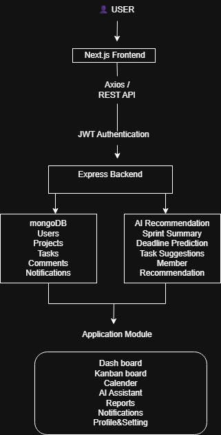

---

# 🗄 Database Design (ERD)

Collections

- Users
- Projects
- Tasks
- Comments
- Notifications

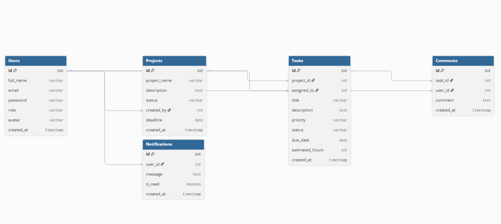

---

# 🎨 UI/UX Wireframes

Designed using **Figma**.

## Figma Link

## 🎨 UI/UX Wireframes

The complete UI wireframes are included in this repository under the **images/** folder.

> Note: The original Figma file was created in a restricted Team Project workspace, so public link sharing is unavailable.
```

---

## Designed Screens

- Landing Page
- Login
- Signup
- Dashboard
- Kanban Board
- Task Details
- Calendar
- Team Members
- Reports
- AI Assistant
- Profile & Settings

---

# 📷 Screenshots

## Landing Page

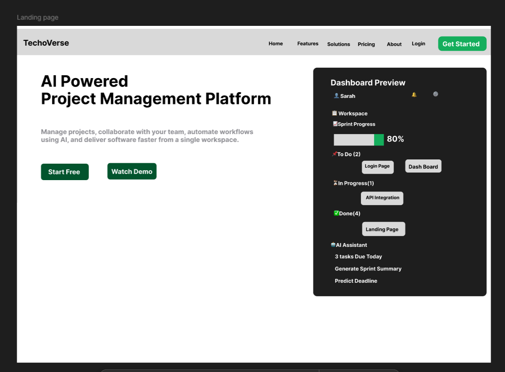

---

## Login

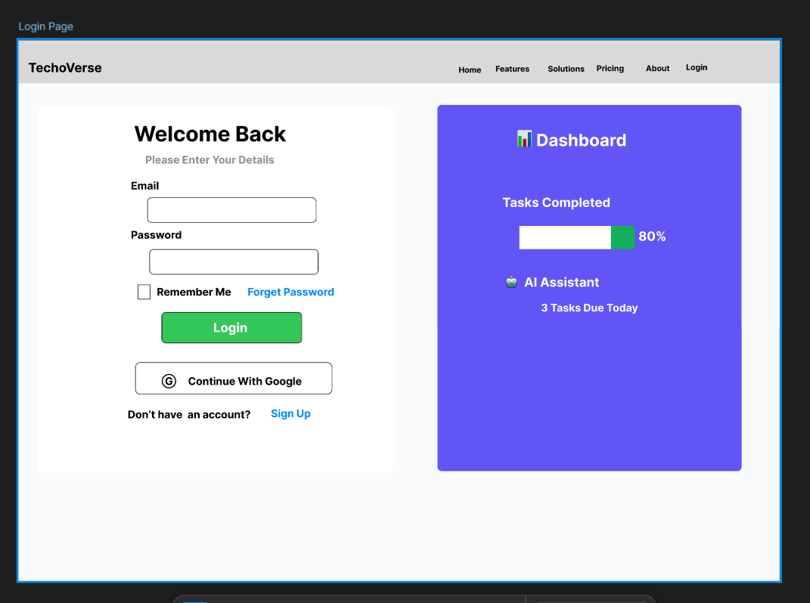

---

## SignUp

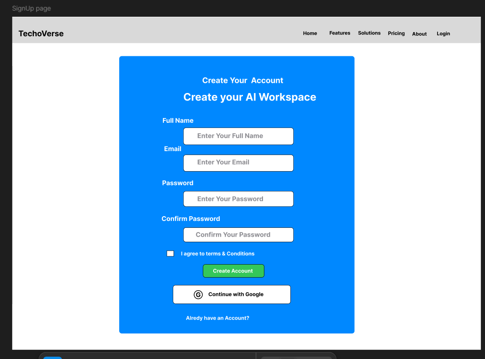


## Dashboard

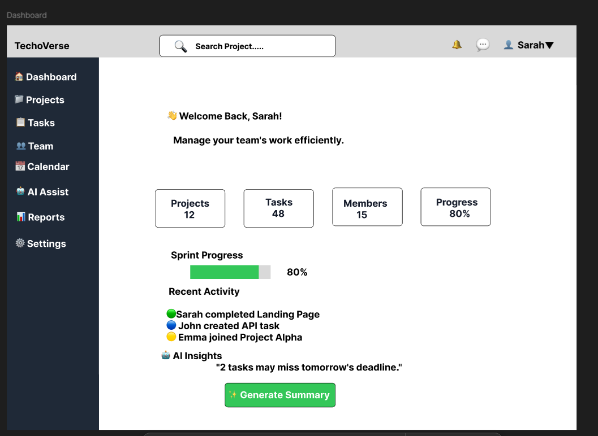

---

## Kanban Board

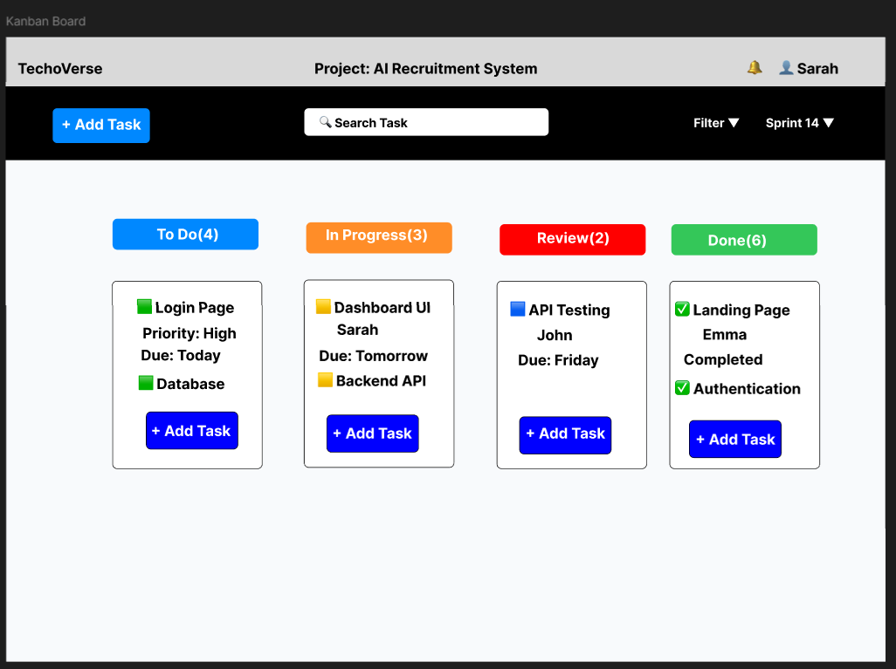

---

## Task Details

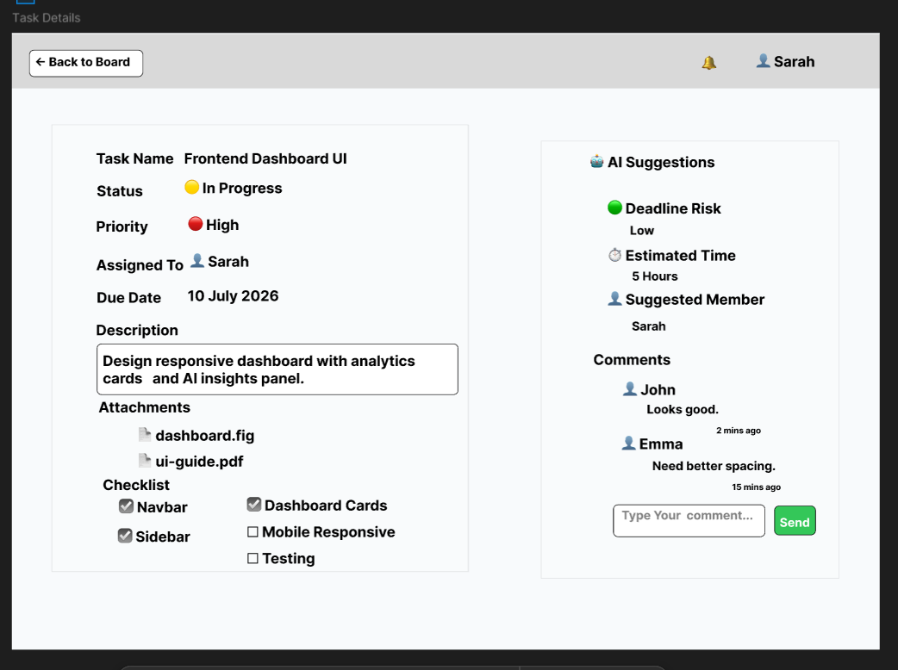

---

## Calendar

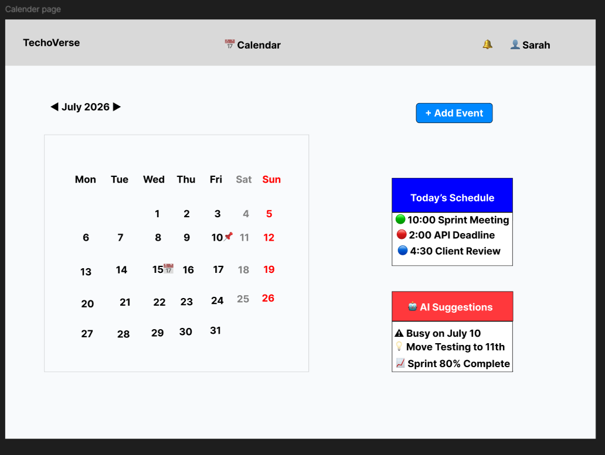

---

## Team Members

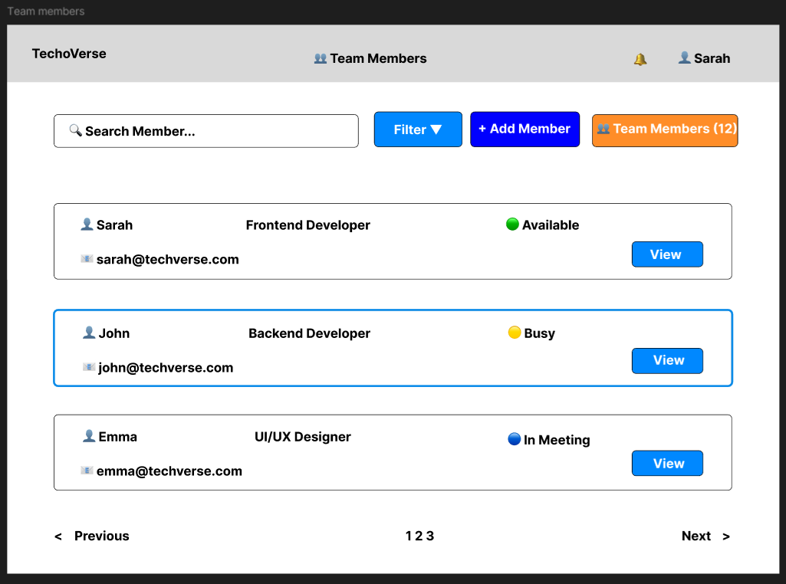

---

## Reports

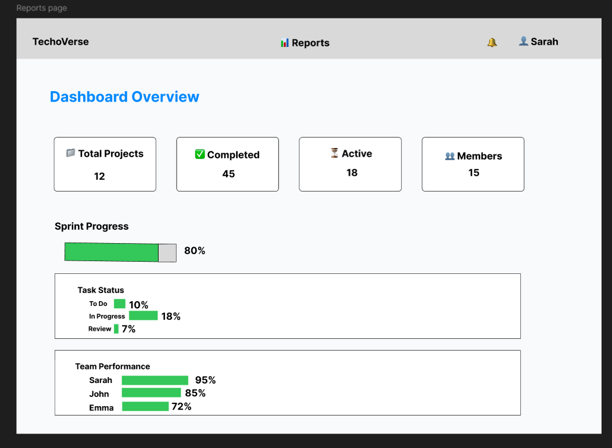

---

## AI Assistant

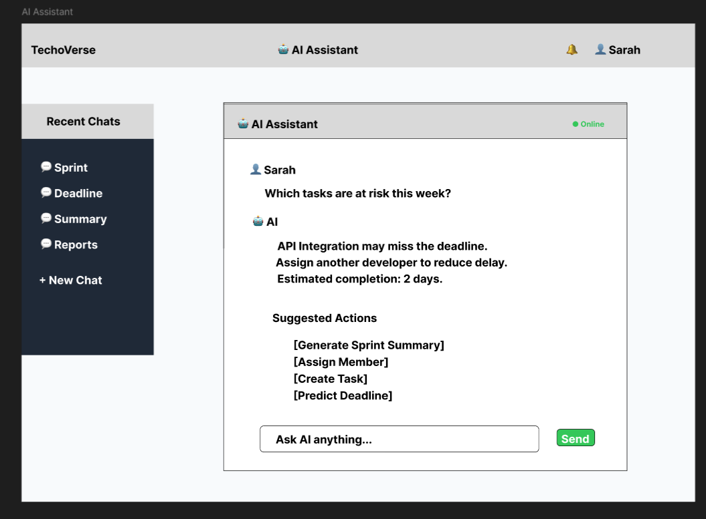

---

## Profile

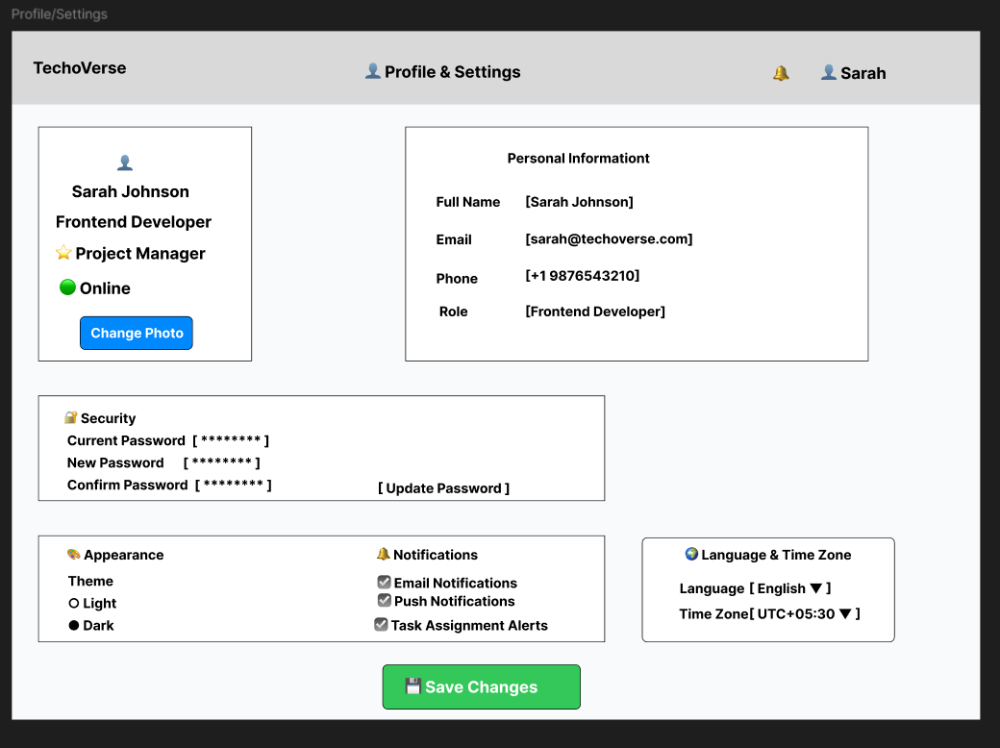

---

# 📡 Planned REST APIs

| Method  | Endpoint         | Description   |
|---------|----------------- |-------------  |
| POST    | /api/auth/signup | Register User |
| POST    | /api/auth/login  | Login         |
| GET     | /api/projects    | Get Projects  |
| POST    | /api/projects    | Create Project|
| PUT     | /api/projects/:id| Update Project|
| DELETE  | /api/projects/:id| Delete Project|
| GET     | /api/tasks       | Get Tasks     |
| POST    | /api/tasks       | Create Task   |
| PUT     | /api/tasks/:id   | Update Task   |
| DELETE  | /api/tasks/:id   | Delete Task   |
| GET     | /api/notifications| Notifications|
| POST    | /api/comments    | Add Comment   |

---

# 📂 Project Folder Structure

```
prodesk-capstone-TechVerse/

│── README.md

│── Prompts.md

│── images/

│     architecture.png

│     erd.png

│     landing.png

│     login.png

│     signup.png

│     dashboard.png

│     kanban.png

│     task-details.png

│     calendar.png

│     team-members.png

│     reports.png

│     ai-assistant.png

│     profile.png

│
├── client/
│
├── server/
│
└── docs/
```

---

# 🚀 Installation

```bash
git clone https://github.com/YOUR_USERNAME/prodesk-capstone-TechVerse.git

cd prodesk-capstone-TechVerse

npm install

npm run dev
```

---

# 📅 Development Roadmap

## Sprint 13

✅ Product Planning

✅ PRD

✅ README

✅ Figma Wireframes

✅ ERD

✅ Architecture Diagram

---

## Sprint 14

- Authentication
- Dashboard
- Project CRUD
- Task CRUD

---

## Sprint 15

- Team Management
- Calendar
- Reports
- Notifications

---

## Sprint 16

- AI Integration
- UI Improvements
- Performance Optimization

---

## Sprint 17

- Testing
- Deployment
- Final Presentation

---

# 💡 Future Enhancements

- AI Sprint Prediction
- AI Task Prioritization
- File Upload
- Real-Time Chat
- Email Notifications
- Dark Mode
- Mobile Application
- Payment Gateway Integration

---

# 📚 Documentation

- Product Requirements Document (PRD)
- UI Wireframes (Figma)
- Entity Relationship Diagram (ERD)
- System Architecture
- Prompts.md

---

# 👩‍💻 Author

**Name:** Anantha Lakshmi

**Company:** Prodesk IT

**Track:** Full Stack Development

**Project:** TechoVerse

---

# 📄 License

This project is developed for educational and internship purposes as part of the **Prodesk IT Full Stack Development Capstone Program**.